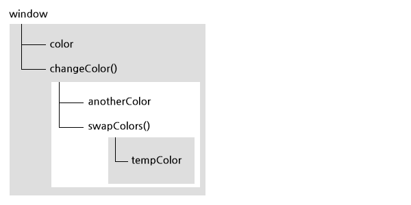

Function 타입
=====

## 실행 컨텍스트와 스코프

* 변수나 함수의 실행 컨텍스트는 다른 데이터에 접근할 수 있는지, 어떻게 행동하는지를 규정합니다.
* 각 실행 컨텍스트에는 변수 객체(Variable Object)가 연결되어 있으며 해당 컨텍스트에서 정의된 모든 변수와 함수는 이 변수 객체에 존재합니다.
* 가장 바깥쪽에 존재하는 실행 컨텍스트는 전역 컨텍스트입니다.
* 함수를 호출하면 독자적인 실행 컨텍스트가 생성되고, 코드를  실행 합니다.
* 실행 컨텍스트에서 코드 실행 중 다른 함수가 실행될 때마다 함수의 컨텍스트가 컨텍스트 스택에 쌓입니다. 함수의 실행이 끝나면 해당 컨텍스트를 스택에서 꺼내고 컨트롤을 이전 컨텍스트에 반환합니다.
* 컨텍스트에서 코드를 실행하면 변수 객체에 스코프 체인이 만들어 집니다. 스코프 체인은 실행 컨텍스트가 접근할 수 있는 모든 변수와 함수에 순서를 정의하는 것입니다.
* 컨텍스트에서 식별자를 찾을 때는 스코프 체인 순서를 따라가면서 식별자 이름을 검색하고, 찾을 수 없으면 에러가 발생합니다.

```js
var color = 'blue';

function changeColor()  {
    var anotherColor = 'red';
    
    function swapColors() {
        var tempColor = anotherColor;
        
        anotherColor = color;
        color = tempColor;
        
        // color, anotherColor, tempColor 모두 접근가능
    }
    
    // color, anotherColor 접근 가능, tempColor 접근 불가능
    swapColors();
}
// color 만 접근 가능
changeColor();
```

> 이 코드에는 실행 컨텍스트가 세 개 있습니다. 전역 컨텍스트, changeColor() 의 로컬 컨텍스트, swapColors() 의 로컬컨텍스트 세 개 입니다.



*****

## arguments, this 객체

함수를 호출하면 프로그램의 제어를 매개변수와 함께 호출한 함수로 넘깁니다.
모든 함수는 명시되어 있는 매개변수에 더해서 `this`와 `arguments` 라는 추가적인 매개변수를 받게 됩니다.

### this

함수가 실행 중인 컨텍스트 객체에 대한 참조이며, 이 값은 함수를 호출하는 시점에 의해 결정된니다.

자바스크립트에서 함수를 호출하는 패턴은 네 가지가 있습니다.

1. 메서드 호출
2. 함수 호출
3. 생성자 호출
4. apply 호출

각 패턴에 따라 `this` 라는 추가적인 매개변수를 다르게 초기화 합니다.

#### 메서드 호출 패턴

객체의 속성의 값이 함수일 때 이 함수를 메서드라고 부르고, 메서드를 호출할 때 `this`는 메서드를 가지고 있는 객체에 바인딩 됩니다.

```js
var name = 'The Window';

var object = {
    name: 'My Object',

    getNameFunc: function() {
        return this.name;
    }
};

console.log( object.getNameFunc() );
```

#### 함수 호출 패턴

함수가 객체의 속성이 아닌 경우에, `this`는 전역객체(window)에 바인딩 됩니다.(스트릭트 모드가 아닐 떄)
전역함수 뿐만 아니라, 내부함수, 메서드의 내부함수일 경우에도 `this`는 전역객체에 바인딩 됩니다.

```js
var name = 'The Window';

var object = {
    name: 'My Object',

    getNameFunc: function() {
        return function() {
            return this.name;
        }
    }
};

console.log( object.getNameFunc()() );
```

```js
var name = 'The Window';

var object = {
    name: 'My Object',

    getNameFunc: function() {
        var that = this;                // this 유지 : this === object

        return function() {
            return that.name;
        }
    }
};

console.log( object.getNameFunc()() );
```

#### 생성자 호출 패턴

생성자로 생성한 객체가 this에 바인딩 됩니다.

#### apply 호출 패턴

함수 호출을 하면서 `this` 와 인수를 넘길 수 있다.

```js
func.apply(thisArg, [argsArray])

// thisArg: 함수 내부의 this에 바인딩할 객체
// argsArray: 함수에 전달할 인자 배열

window.color = 'red';
var o = { color: 'blue' };

function sayColor() {
    console.log(this.color);
}

sayColor();
sayColor.call(o);
```

### arguments 객체

함수를 호출할 때 추가적인 매개변수로 `arguments` 라는 객체를 사용할 수 있습니다. 이 객체는 함수를 호출할 때 전달된 모든 인수에 접근할 수 있게 합니다. 

`arguments` 객체는 `length` 프로퍼티를 가지고 있어 배열과 비슷하지만 실제 배열은 아닙니다. 따라서 모든 배열이 가지고 있는 메서드는 없습니다.

```js
function max() {
    var result = Number.NEGATIVE_INFINITY;
    
    for(var i = 0, len = arguments.length; i < len; i++) {
        if(result < arguments[i]) {
            result = arguments[i];
        }
    }
    return result;
}

console.log(max(12, 23, 23, 5, 12, 123));
```

> arguments 객체로 인수에 접근 가능하다고 해도, 구현가능하다면 명명된 매개변수로 접근하는 것이 가독성 및 인수 관리 측면에서 더 바람직합니다.