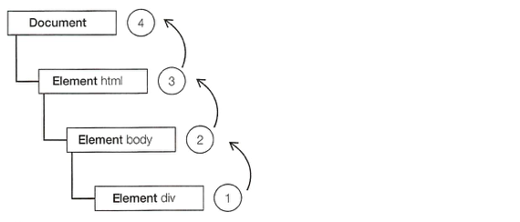
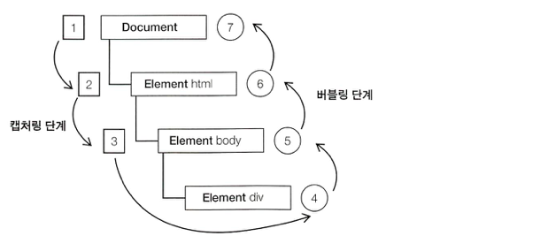

Javascript Study Step05
=====

## 이벤트

### 이벤트 주도(event-driven) 프로그래밍 언어 자바스크립트

자바스크립트와 HTML의 상호작용은 문서나 브라우저에서 특정 순간에 일어난 일을 가리키는 **이벤트**에 의해 처리됩니다.

### 옵저버 패턴

이벤트가 발생하면 **이벤트 핸들러(리스너)**로 감지하며 해당 이벤트가 일어날 때 실행되는 함수를 등록할 수 있습니다.

**주요 이벤트 종류**

[Event reference | MDN](https://developer.mozilla.org/en-US/docs/Web/Events)

### 이벤트 흐름 : 버블링

문서 트리에서 가장 깊이 위치한 요소에서 시작해 document 객체까지 거슬러 올라가는 이벤트 흐름

```html
<!DOCTYPE html>
<html>
<head>
    <title>Event Bubbling Example</title>
</head>
<body>
    <div id="myDiv">Click ME</div>
</body>
</html>
```

`<div>` 요소를 클릭하면 click 이벤트가 다음 순서대로 발생합니다.

1. `<div>`
2. `<body>`
3. `<html>`
4. `document`



이벤트 캡처링은 반대로 동작합니다.

### DOM 이벤트 흐름

1. 캡처링 단계
2. 타깃 단계
3. 버블링 단계



버블링 단계에서 이벤트 처리 작업을 합니다.

### 이벤트 핸들러

이벤트가 일어났을 때 호출되는 함수를 이벤트 핸들러(이벤트 리스너) 라고 부릅니다.

### 브라우저 비호환성의 이해와 처리

| 영역                  | 설명                                           | 비호환성       |
| --------------------- | ---------------------------------------------- | -------------- |
| 이벤트                | 핸들러가 실행되도록 하는 이밴트, 행동          | 약간           |
| 이벤트 핸들러 등록    | 이벤트가 발생했을 때 어떤 함수가 실행될지 정의 | 약간(W3C와 MS) |
| 이벤트 버블링, 캡처링 | HTML요소 관계에서의 이벤트 핸들러 처리 순서    | 약간           |
| 이벤트 객체           | 이벤트에 대한 정보를 담고있는 객체             | 많음           |
| 타깃팅                | 이벤트와 관련된 요소 알아내기                  | 약간           |

#### HTML 이벤트 핸들러

```html
<input type="button" value="Click Me" onclick="alert('Clicked')" />
```

```html
<script>
function showMessage() {
    alert('Clicked');
}
</script>

<input type="button" value="Click Me" onclick="showMessage()" />
```

이벤트 핸들러를 HTML에서 할당하면서 HTML와 자바스크립트가 단단히 묶이게 된다. HTML과 자바스크립트는 분리하는 것이 좋다.

#### DOM 레벨 0 이벤트 핸들러

전통적인 방법. 객체에 대한 참조를 얻고, 객체의 이벤트 핸들러 프로퍼티에 함수를 할당하는 방법입니다.

```js
var btn = document.getElementById('myBtn');

btn.onclick = function() {
    console.log(this.id);
}
```

> 이벤트 핸들러의 스코프
> 이벤트 핸들러 내부에서의 this를 통해 요소의 프로퍼티나 메서드에 접근 가능합니다.

```js
// 이벤트 핸들러 제거
btn.onclick = null;
```

이벤트 핸들러를 여러개 추가할 수 없다.

#### DOM 레벨 2 이벤트 핸들러(IE9+)

* addEventListener()
* removeEventListener()

```js
element.addEventListener('eventType', handler [, useCapture]);
element.removeEventListener('eventType', handler [, useCapture]);
```

```js
var btn = document.getElementById('myBtn');

btn.addEventListener('click', function() {
    console.log(this.id);
}, false);

btn.addEventListener('click', showMessage, false);

function showMessage() {
    console.log('Clicked');
}

btn.removeEventListener('click', showMessage, false);
```

#### IE 이벤트 핸들러(~IE8)

IE8 이전 버전은 이벤트 버블링만 지원하므로, `attachEvent()` 로 추가한 이벤트 핸들러는 버블링 단계에서만 실행됩니다.

* attachEvent()
* detachEvent()

```js
element.attachEvent('on' + 'eventType', handler);
element.detachEvent('on' + 'eventType', handler);
```

```js
var btn = document.getElementById('myBtn');

btn.attachEvent('onclick', function() {
    console.log('Clicked');
});
```

> IE 이벤트 핸들러의 스코프는 전역

```js
var btn = document.getElementById('myBtn');

btn.attachEvent('onclick', function() {
    console.log(this.id);
    console.log(this === window);
});
```

#### 크로스 브라우저 이벤트 핸들러

브라우저의 차이를 메우기 위해 자바스크립트 라이브러리를 이용하거나, 커스텀 코드를 직접 작성해서 사용합니다. 크로스 브라우징을 위해 기능탐지, 퀵스탐지, 브라우저식별(UA) 등이 있는데, 범용적이고 지속적으로 사용할 수 있는 방법을 선택하는 것이 좋습니다.

* addHandler()
* removeHandler()

```js
var EventUtil = {               // 이벤트 관련 크로스브라우징 유틸객체
    
    addHandler: function(element, type, handler) {
        if(element.addEventListenr) {
            element.addEventListenr(type, handler, false);
        } else if(element.attachEvent) {
            element.attachEvent('on' + type, handler);
        } else {
            element['on' + type] = handler;
        }
    },

    removeHandler: function(element, type, handler) {
        if(element.removeEventListener) {
            element.removeEventListener(type, handler, false);
        } else if(element.detachEvent) {
            element.detachEvent('on' + type, handler);
        } else {
            element['on' + type] = null;
        }
    }
}
```

```js
var btn = document.getElementById('myBtn');

var handler = function() {
    console.log('Clicked');
};

EventUtil.addHandler(btn, 'click', handler);
EventUtil.removeHandler(btn, 'click', handler);
```

> 브라우저간 이벤트 핸들러를 추가하고 제거하는 기능을 구현

### 이벤트 객체

DOM과 관련된 이벤트가 발생하면 이벤트가 발생한 요소, 이벤트 타입 등의 정보는 모두 event라는 객체에 저장됩니다.

#### DOM event 객체

이벤트 핸들러를 할당할 때 DOM 레벨 0 방법을 썼든 DOM 레벨 2 방법을 썼든 관계없이 event 객체가 전달됩니다.

```js
var btn = document.getElementById('myBtn');
btn.onclick = function(e) {
    console.log(e.type);            // 'click'
};

btn.addEventListener('click', function(e) {
    console.log(e.type);            // 'click'
});
```

**event 객체의 기본정보**

| 프로퍼티/메서드 | 내용 |
| ---- | ---- |
| currentTarget | 현재 이벤트를 처리 중인 요소(이벤트 핸들러를 등록한 요소) |
| preventDefault() | 이벤트의 기본 행동을 취소합니다. |
| stopPropagation() | 이벤트 캡처링, 버블링을 취소합니다. |
| target | 이벤트의 타깃입니다. |
| type | 발생한 이벤트의 타입입니다. |

> 이벤트 핸들러 내부에서 `this` 객체는 항상 `currentTarget` 의 값과 일치하며, `target` 은 이벤트의 실제 타깃만 포함합니다.
> 예제 필요